<h1 align="center">📱 MAD Assignment 2025 – Android Projects in Java</h1>

<p align="center">
  A complete collection of 5 Android apps built in Java, showcasing key Android concepts like unit conversion, theme switching, Lottie animation, Firebase Google Sign-In, and a photo gallery with camera access.
</p>

<p align="center">
  <a href="https://developer.android.com"></a>
  
  
</p>

---

## 📁 Folder Structure

```bash
MAD_Assignment_2025/
├── Q1_UnitConverter/           # 📏 Unit Converter App
├── Q2_ThemeSettings/           # 🌙 Theme Toggle App (Dark/Light)
├── Q3_LottieAnimation/         # 🎞️ Lottie Animation Viewer
├── Q4_GoogleAuth/              # 🔐 Google Sign-In with Firebase
├── Q5_PhotoGallery/            # 📸 Camera + Gallery App
├── Submission/                 # Final PDF, Docs
└── ui_elements/                # 📸 All screenshots and demo video
```

---

## ✅ Q1: Unit Converter App
- Convert between Feet, Inches, Centimeters, Meters, Yards
- Clean and responsive UI
- 📲 [Download APK](Q1_UnitConverter/UnitConverter.apk)

<p align="center">
  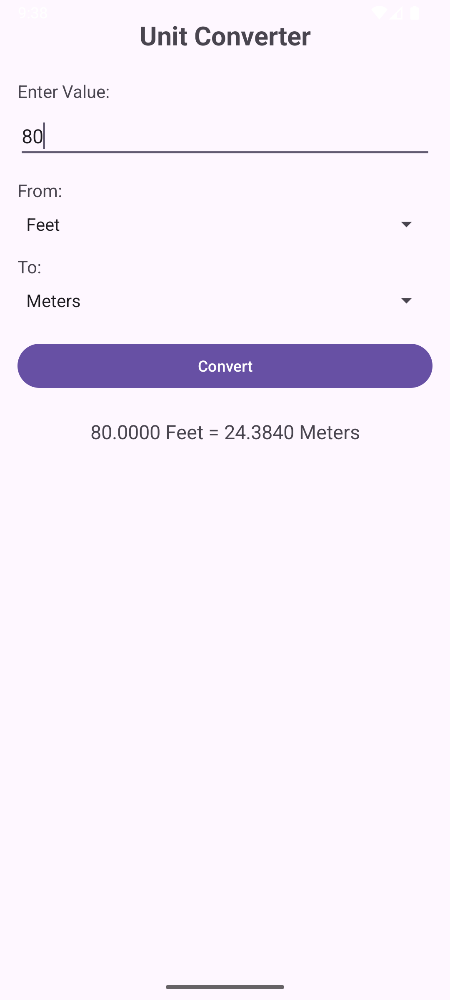
</p>

---

## ✅ Q2: Theme Settings App
- Toggle between Light & Dark Mode
- Persistent theme using SharedPreferences
- Dynamic settings icon changes by theme
- 📲 [Download APK](Q2_ThemeSettings/ThemeSettings.apk)

<p align="center">
  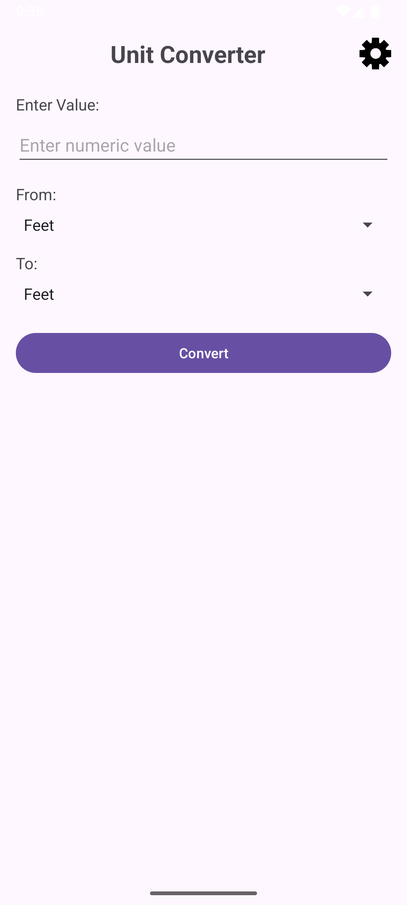
  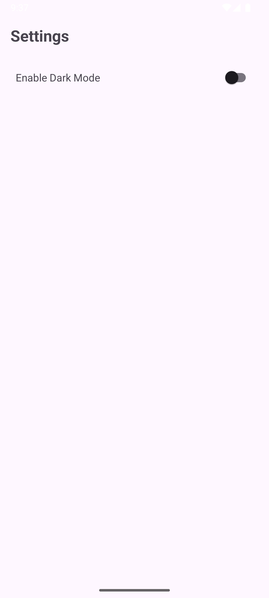
  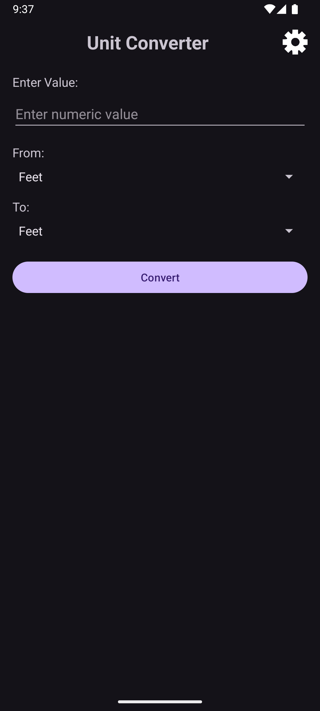
  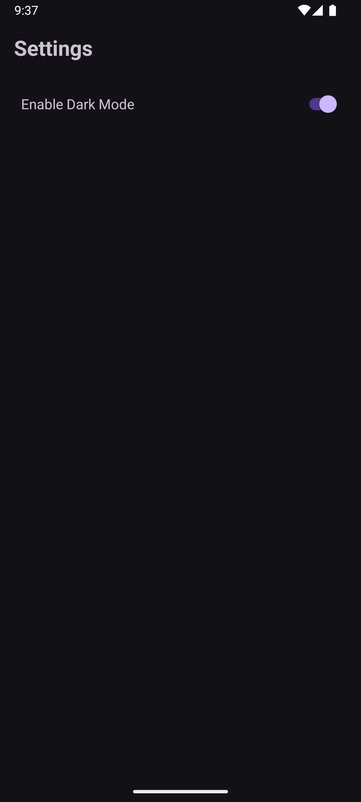
</p>

---

## ✅ Q3: Lottie Animation App
- Smooth playback of Lottie animation from `res/raw`
- Uses LottieAnimationView
- 📲 [Download APK](Q3_LottieAnimation/LottieAnimation.apk)

🎥 **Demo Video:**
[Click to watch](ui_elements/q3_ui_1.mp4)

---

## ✅ Q4: Google Sign-In App
- Login via Google using Firebase Authentication
- Displays user name/email after login
- Sign-out revokes access to force account picker next time
- 📲 [Download APK](Q4_GoogleAuth/GoogleAuth.apk)

<p align="center">
  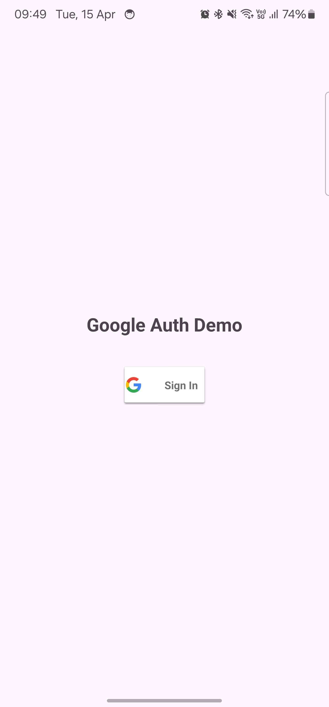
  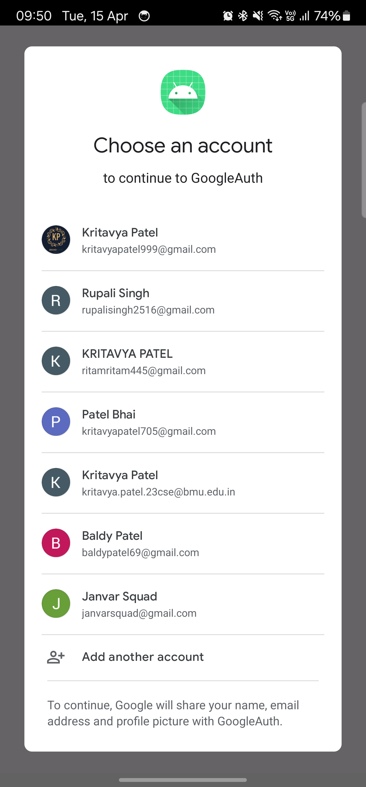
  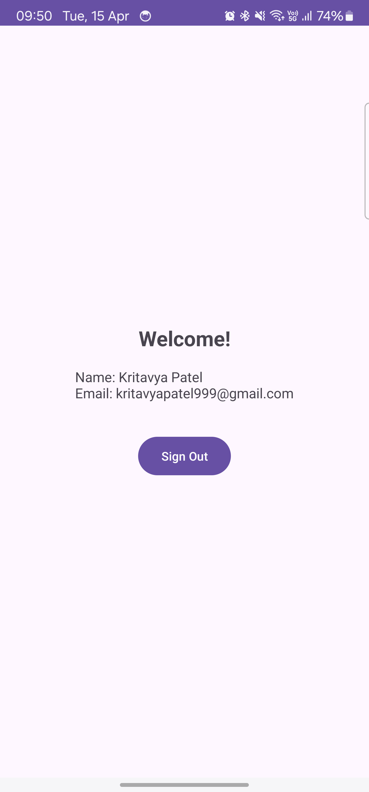
</p>

---

## ✅ Q5: Photo Gallery App
- Capture photos using camera
- Browse images from folder in grid view
- Tap an image to view:
  - File name
  - Size
  - Path
  - Date
- Delete image with confirmation
- Option to select a whole folder and load images
- Multi delete image functionality 
- 📲 [Download APK](Q5_PhotoGallery/PhotoGallery.apk)

<p align="center">
  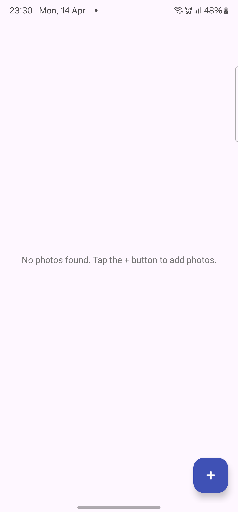
  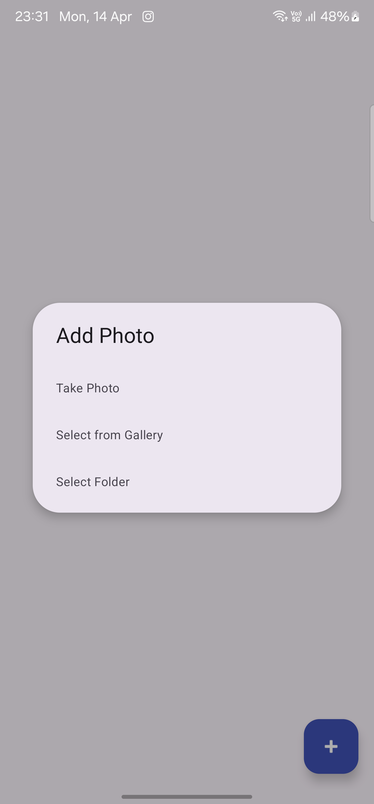
  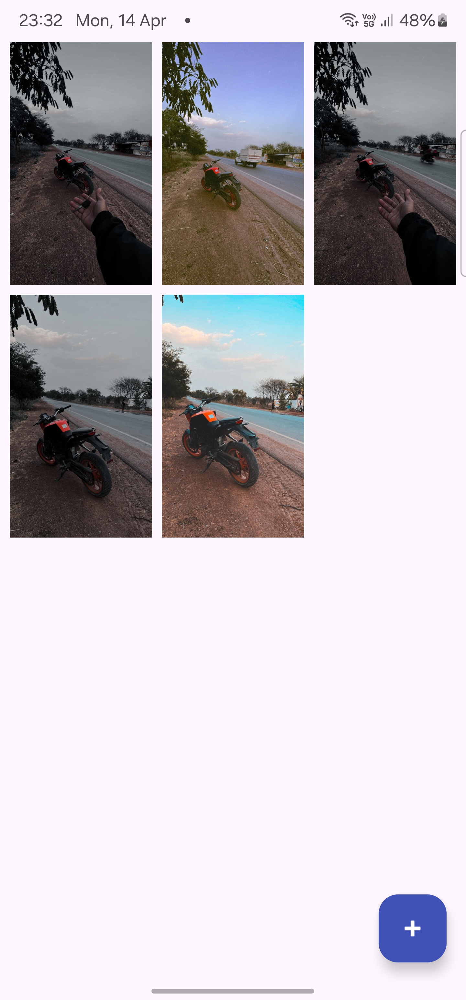
  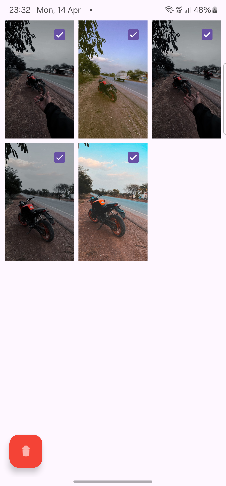
  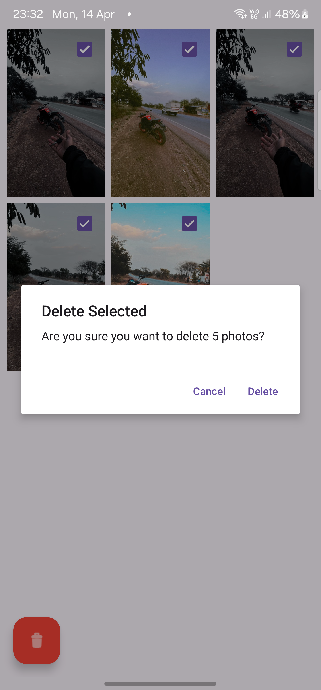
  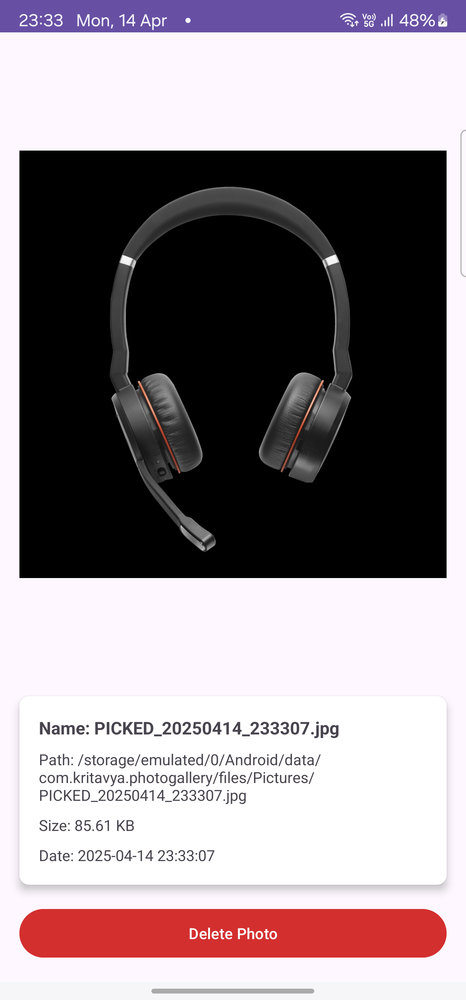
</p>

---

## 📦 APKs Included

Each folder contains its respective `.apk` file for installation and testing:

```
Q1_UnitConverter/UnitConverter.apk
Q2_ThemeSettings/ThemeSettings.apk
Q3_LottieAnimation/LottieAnimation.apk
Q4_GoogleAuth/GoogleAuth.apk
Q5_PhotoGallery/PhotoGallery.apk
```

---

## 🙋‍♂️ Author

**Kritavya Patel**  
📧 [kritavyapatel@gmail.com](mailto:kritavyapatel@gmail.com)  
💻 [GitHub: @Kritavya](https://github.com/Kritavya)  
📸 [Instagram: @kritavya](https://instagram.com/kritavya)  
🔗 [LinkedIn: Kritavya Patel](https://www.linkedin.com/in/kritavya)
